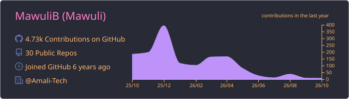
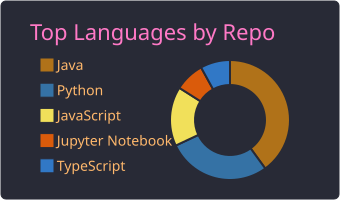
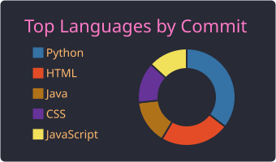
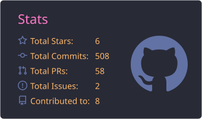
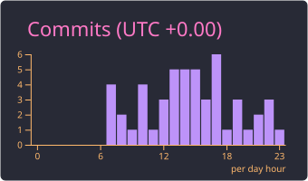

<h1 align="center">Hi, I'm Mawuli Badassou 👋</h1>

<!-- Cycling subtitle (roles only — name stays static above) -->

---

## 🧑‍💻 About Me

- ☁️ **DevOps & Data Engineer** at **AmaliTech**, based in Accra, Ghana
- 🏗️ I design, automate, and observe cloud infrastructure on **AWS** with **Terraform**, **Ansible**, and **CI/CD**
- 🔀 I build and tune **Spark** ETL pipelines for a financial services data platform, including one where I halved the runtime from 218 to ~105 minutes
- 📊 Observability fan: **Prometheus**, **Grafana**, **Jaeger**
- 🌱 Currently deepening **Kubernetes**, **GitOps**, and **platform engineering**
- 📫 Reach me: **mawulibadassou5@gmail.com**

---

## 🌐 Connect With Me

  
  
  
  
  

---

## 🚀 Featured Projects

<table>
  <tr>
    <td width="50%" valign="top">
      <h3><a href="https://dynamiqconcept.thinks.work">📸 Dynamiq Concept</a></h3>
      Live booking and payments platform for a photography studio, with a data and airtime shop on the same deployment. Two Paystack accounts sit behind one signature-verified, idempotent webhook.
        
      <code>Next.js</code> <code>TypeScript</code> <code>Prisma</code> <code>PostgreSQL</code> <code>Paystack</code> <code>Vercel</code>
    </td>
    <td width="50%" valign="top">
      <h3><a href="https://github.com/MawuliB/terraform_disaster_recovery">🛟 Multi-Region DR on AWS</a></h3>
      Pilot-light disaster recovery across two regions. A Route 53 health check triggers a Lambda that scales up the standby fleet and promotes the RDS replica.
        
      <code>Terraform</code> <code>AWS</code> <code>Lambda</code> <code>Route 53</code> <code>RDS</code>
    </td>
  </tr>
  <tr>
    <td width="50%" valign="top">
      <h3><a href="https://github.com/MawuliB/monitoring-tool">🔎 Multi-Cloud Log Manager</a></h3>
      One dashboard to search, tail, and chart logs from AWS, Azure, GCP, Elasticsearch, and local hosts, shipped by a Jenkins pipeline.
        
      <code>FastAPI</code> <code>Angular</code> <code>Docker</code> <code>Jenkins</code>
    </td>
    <td width="50%" valign="top">
      <h3><a href="https://github.com/MawuliB/mawuli">💻 Terminal Portfolio</a></h3>
      My <a href="https://mawuli.thinks.work">portfolio site</a>: a CRT-terminal themed Angular app, prerendered to static HTML and driven by a single JSON file.
        
      <code>Angular</code> <code>TypeScript</code> <code>SSG</code> <code>Vercel</code>
    </td>
  </tr>
</table>

---

## 🛠️ Tech Stack

**☁️ Cloud & IaC** 

**⚙️ CI/CD & Configuration** 

**🐳 Containers, Orchestration & Messaging** 

**📊 Observability** 

**🔀 Data Engineering** 

**💻 Languages & Frameworks** 

**🗄️ Databases** 

**🧰 Tools** 

**🌱 Currently Learning** 

---

## 🏅 Certifications

  
  
  
  
  

AWS Solutions Architect · AWS Developer · AWS Cloud Practitioner · Azure Administrator · KCNA. Click a badge to verify.

---

## 📊 GitHub Stats

<!-- Cards are generated daily by .github/workflows/profile-assets.yml -->

  

  

<picture>
  <source media="(prefers-color-scheme: dark)" srcset="https://raw.githubusercontent.com/MawuliB/MawuliB/output/github-snake-dark.svg" />
  <source media="(prefers-color-scheme: light)" srcset="https://raw.githubusercontent.com/MawuliB/MawuliB/output/github-snake.svg" />
  
</picture>

---

## ☕ Support

  

  <i>Built it. Broke it. Automated it. Observed it.</i>

